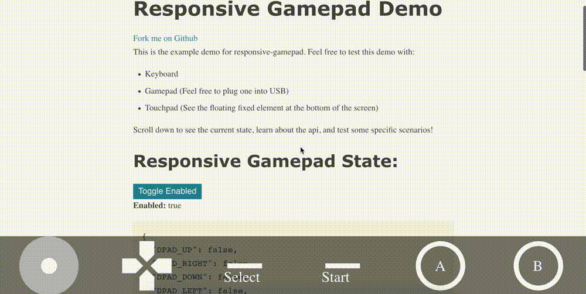

# responsive-gamepad

<!-- Badges -->
[](https://travis-ci.org/torch2424/responsive-gamepad)


Handle Keyboard, Gamepad, and Touch Controls in the browser under a single API.

[Demo](https://torch2424.github.io/responsive-gamepad/)



# Table Of Contents


# Quick Start

This is a quick **Tl;DR** on installing and using responsive-gamepad:

1. `npm install --save responsive-gamepad`

2. `import { ResponsiveGamepad } from 'responsive-gamepad';`

3. `ResponsiveGamepad.enable();`

4. `ResponsiveGamepad.getState();`

Please see the [Input Map](#inputmap) section for what Responsive Gamepad Keys represent on a "Standard" Controller.

# Projects Using `responsive-gamepad`

* [WasmBoy](https://github.com/torch2424/wasmBoy) - Gameboy / Gameboy Color Emulator written for Web Assembly using AssemblyScript.

# Instalation

*See the [demo/index.js](./demo/index.js), for a proper usage, and touch input example*

`npm install --save responsive-gamepad`

# API

*Additional information/exports concerning  can be found in the [Input Map](#inputmap) section.*

*For user journeys, and common How-To use cases, see the [design](./design) directory*

First, import the `ResponsiveGamepad` singleton service with:

`import ResponsiveGamepad from 'responsive-gamepad'`

## ResponsiveGamepad

* `enable()`: void - Enables `ResponsiveGamepad`, and listens for events.

* `disable()`: void - Removes all listeners from ResponsiveGamepad, and stops listening.

* `isEnabled()`: boolean - Returns if `ResponsiveGamepad` is currently enabled.

# Input Map

The default input map is based on the **"Standard"** controller. Here is a modified image from the [w3c gamepad draft](https://w3c.github.io/gamepad/#remapping) on how it correlates to the default input map:

**Note: The X in something like `INPUT_X` represents one of the many directions or axis it represents**


To see how the keyboard relates to the input map, please see the [default input map](./lib/keymap.js). The library uses [KeyBoardEvent.code](https://developer.mozilla.org/en-US/docs/Web/API/KeyboardEvent/code) to denote all of it's keyboard keys.

# Plugins

Plugins allow for modifying the output from getState(). Which can allow for functionality like:

* Merging multiple inputs into one
 
* Adding additional keys for something like another input source.

* Etc...

`responsive-gamepad` Plugins should follow the [rollup plugin conventions](https://rollupjs.org/guide/en#conventions):

* Plugins should have a clear name with `responsive-gamepad-plugin-` prefix.

* Include `rollup-plugin` keyword in package.json.

* Document your plugin in English.

## How to build plugins

**For and example, see the demo [ExamplePlugin](./demo/examplePlugin.js).**

Plugins are simply functions that return an object. See the following example, for what functions the return object could have:

```
export default function ReadmePlugin() {
  return {
    onAddPlugin: () => {
      // Called when the plugin is added with: 'ResponsiveGamepad.addPlugin()'
    },
    onGetState: (CurrentResponsiveGamepadState) => {
      // Called whenever 'ResponsiveGamepad.getState()' is called.
      return CurrentResponsiveGamepadState
    }
  }
}
```

## Featured Plugins

*Open a PR to have your plugin featured here!*

# Contributing

Feel free to fork the project, open up a PR, and give any contributions! I'd suggest opening an issue first however, just so everyone is aware and can discuss the proposed changes.

### Installation

Just your standard node app. Install Node with [nvm](https://github.com/creationix/nvm), `git clone` the project, and `npm install`, and you should be good to go!

### CLI Commands / Npm Scripts

```bash
# Command to serve the demo/lib and watch for changes (No livereload)
npm start

# Alias for npm start
npm run dev

# Build the library and demo souce
npm run build
```

# LICENSE

LICENSE under [Apache 2.0](https://choosealicense.com/licenses/apache-2.0/)

# Other Notes

* Touch Input SVGS on the responsive gamepad demo, are [Google Material Icons](https://material.io/tools/icons/?style=baseline)

* XInput vs. DirectInput - [Microsoft Article](https://docs.microsoft.com/en-us/windows/desktop/xinput/xinput-and-directinput), [Reddit thread](https://www.reddit.com/r/pcgaming/comments/4zlbrx/what_is_the_difference_between_directinput_and/)
