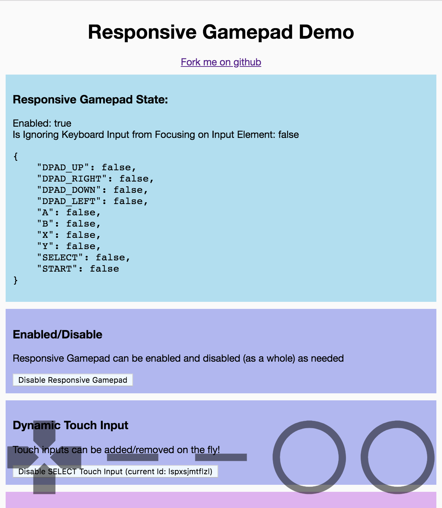
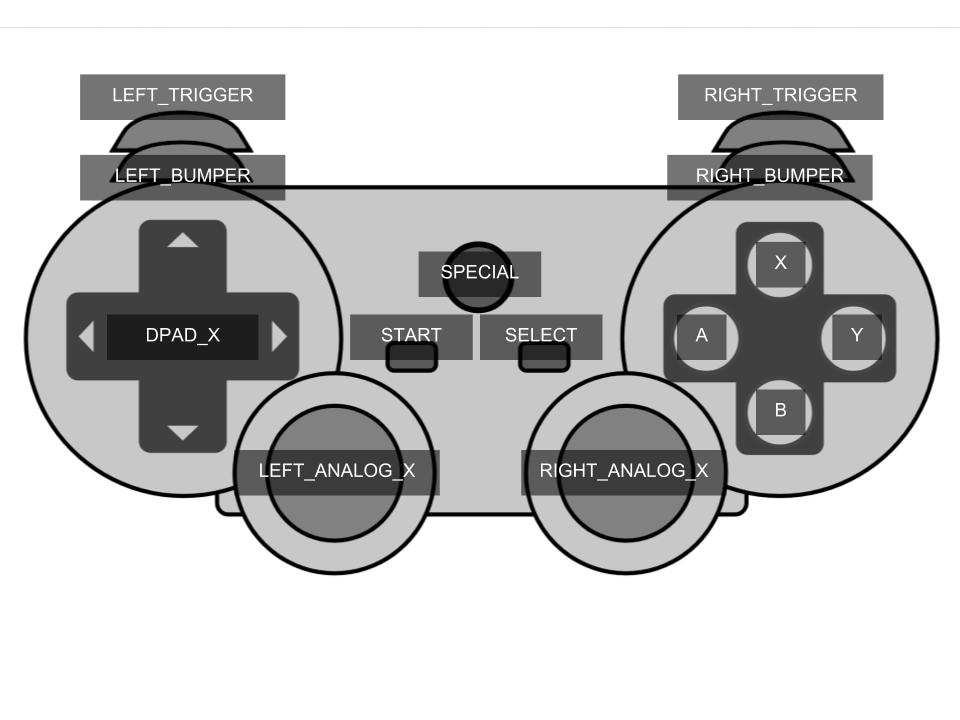

# responsive-gamepad

<!-- Badges -->
[](https://travis-ci.org/torch2424/responsive-gamepad)


[](https://www.buymeacoffee.com/torch2424)

Handle Keyboard, Gamepad, and Touch Controls in the browser under a single API.

[Demo](https://torch2424.github.io/responsive-gamepad/)



# Table Of Contents

* [Quick Start](#quick-start)
* [Projects Using responsive-gamepad](#projects-using-responsive-gamepad)
* [Instalation](#instalation)
* [API Usage](#api-usage)
  * [enable](#enable)
  * [disable](#disable)
  * [isEnabled](#isenabled)
  * [isIgnoringKeyEvents](#isignoringkeyevents)
  * [addTouchInput](#addtouchinput)
  * [removeTouchInput](#removetouchinput)
* [Keymaps](#keymaps)
  * [Custom Keymaps](#custom-keymaps)
* [Contributing](#contributing)
  * [Installation](#installation)
  * [CLI Commands / Npm Scripts](#cli-commands--npm-scripts)
* [LICENSE](#license)
* [Other Notes](#other-notes)

# Quick Start

This is a quick **Tl;DR** on installing and using responsive-gamepad:

1. `npm install --save responsive-gamepad`

2. `import { ResponsiveGamepad } from 'responsive-gamepad';`

3. `ResponsiveGamepad.enable();`

4. `ResponsiveGamepad.getState();`

Please see the [Keymaps](#keymaps) section for what Responsive Gamepad Keys represent on a "Standard" Controller.

# Projects Using `responsive-gamepad`

* [WasmBoy](https://github.com/torch2424/wasmBoy) - Gameboy / Gameboy Color Emulator written for Web Assembly using AssemblyScript.

# Instalation

*See the [index.js](./index.js) at the root of the project, for a proper usage, and touch input example*

`npm install --save responsive-gamepad`

# API Usage

*Additional information/exports concerning Keymaps can be found in the [Keymaps](#keymaps) section.*

First, import the `ResponsiveGamepad` singleton service with:

`import {ResponsiveGamepad} from 'responsive-gamepad'`

### enable

`ResponsiveGamepad.enable(optionalKeymap)`

Function to enable the gamepad, and start listening for changes.

**Params**

* optionalKeymap: An option keymap that can be applied to the listener. See the [keymap](#keymap) section.

### disable

`ResponsiveGamepad.disable()`

Function to disable the gamepad, and stop listening for changes.

### isEnabled

`ResponsiveGamepad.isEnabled()`

Function to return if the `ResponsiveGamepad` service is currently enabled.

**Returns**

Boolean.

### isIgnoringKeyEvents

`ResponsiveGamepad.isIgnoringKeyEvents()`

Function to return if the `ResponsiveGamepad` service is currently ignoring keyboard events, since we are focused on an input element.

**Returns**

Boolean.

### addTouchInput

`ResponsiveGamepad.addTouchInputs(element, inputType, ...additionArgumentsDependingOnInputType)`

**Params**

* element: HTML element to represent the input

* inputType: String to represent the type of input (See more below)

...additionArgumentsDependingOnInputType Represents any number of arguments depending on the provided inputType. See more below.

**Returns**

* touchInputId: String

**Input Types**

Input Types represent the type of touch input you would like to use. Input types can be obtained by importing `TOUCH_INPUT_TYPES`. Example:

`import {ResponsiveGamepad, TOUCH_INPUT_TYPES} from 'responsive-gamepad';`

As of this writing the available gamepad types are:

**BUTTON**

`TOUCH_INPUT_TYPES.BUTTON` - A single on/off button touch element. Must pass the additional argument of a `RESPONSIVE_GAMEPAD_KEY`. Example:

`ResponsiveGamepad.addTouchInput(myHtmlElement, TOUCH_INPUT_TYPES.BUTTON, RESPONSIVE_GAMEPAD_KEYS.A);` 

**DPAD**

`TOUCH_INPUT_TYPES.DPAD` - A 4 direction Dpad element. Behind the Scenes, the element will be divided into 4 "touch" sections, with a central deadzone, and some bias for horizontal vs vertical. This element will automatically occupy the `RESPONSIVE_GAMEPAD.DPAD_X` keys. Example:

`ResponsiveGamepad.addTouchInput(myHtmlElement, TOUCH_INPUT_TYPES.DPAD);`

**ANALOG**

`TOUCH_INPUT_TYPES.ANALOG` - A movable element that will use its original center and it's current position to determine an analog Axis. The element passed in should represent the "analog stick", not an element containing both the "stick" and its "background". This required the additional argument of "LEFT" vs. "RIGHT". And will occupy the `RESPONSIVE_GAMEPAD.X_ANALOG_Y` respectively. Example:

`ResponsiveGamepad.addTouchInput(myHtmlElement, TOUCH_INPUT_TYPES.ANALOG, 'LEFT')`

### removeTouchInput

`ResponsiveGamepad.removeTouchInput(touchInputId)`

Function to remove listeners from a touch input element.

**Params**

* `touchInputId` - The returned string from `addTouchInput()`, identifying the touch element.

**Returns**

Boolean. True if removed, false if not.

# Keymaps

Keymaps can be found under the [lib/keymaps directory](./lib/keymaps). To use a keymap, pass it in with the `.enable()` function:

```
import {ResponsiveGamepad, KEYMAP_GAMEBOY} from 'responsive-gamepad';

ResponsiveGamepad.enable(KEYMAP_GAMEBOY());
```

The default keymap, `KEYMAP` and `KEYMAP_DEFAULT`, is based on the **"Standard"** controller. Here is a modified image from the [w3c gamepad draft](https://w3c.github.io/gamepad/#remapping) on how it correlates to the default keymap:



* Note: The X in something like `Key_X` represents one of the many directions or axis it represents

### Custom Keymaps

Custom keymaps can also be created and used! All functions used to create keymaps are exported by the lib, and are from the [`lib/schema.js`](./lib/schema.js) file. Please view how the keymaps are constructed within [`./lib/keymaps`](./lib/keymaps).

If you think the keymap should ba a part of the library, feel free to open a PR!

# Contributing

Feel free to fork the project, open up a PR, and give any contributions! I'd suggest opening an issue first however, just so everyone is aware and can discuss the proposed changes.

### Installation

Just your standard node app. Install Node with [nvm](https://github.com/creationix/nvm), `git clone` the project, and `npm install`, and you should be good to go!

### CLI Commands / Npm Scripts

```bash
# Command to serve the project, and watch the debugger, wasm, and lib for changes
# Uses concurrently: https://github.com/kimmobrunfeldt/concurrently
# Concurrently helps cleanup the output and organizes all three watchers/servers
npm start

# Alias for npm start
npm run dev

# Serve the demo (index.js)
npm run demo

# Serve the demo and watch for changes
npm run demo:serve

# Alias for npm run demo:serve
npm run demo:watch

# Build the demo
npm run demo:build

# Build and serve the demo
npm run demo:build:serve

# Watch for changes and build the library source (/lib)
npm run lib:watch

# Build the library souce
npm run lib:build
```

# LICENSE

LICENSE under [Apache 2.0](https://choosealicense.com/licenses/apache-2.0/)

# Other Notes

* Touch Input SVGS on the responsive gamepad demo, are [Google Material Icons](https://material.io/tools/icons/?style=baseline)

* XInput vs. DirectInput - [Microsoft Article](https://docs.microsoft.com/en-us/windows/desktop/xinput/xinput-and-directinput), [Reddit thread](https://www.reddit.com/r/pcgaming/comments/4zlbrx/what_is_the_difference_between_directinput_and/)
